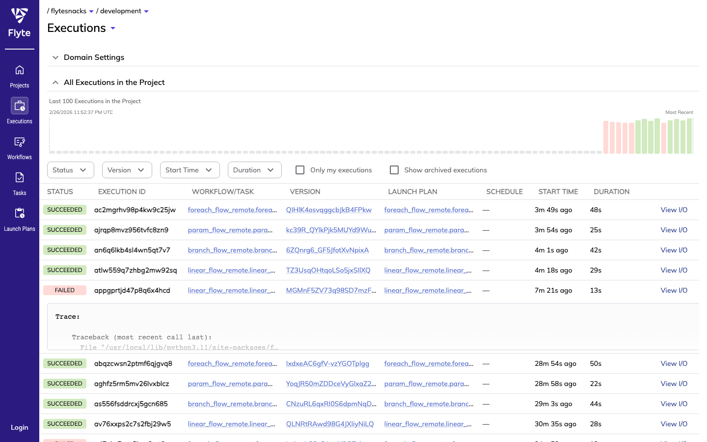
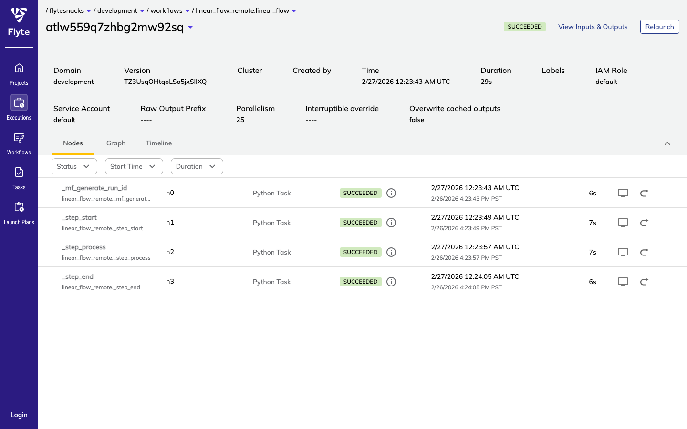
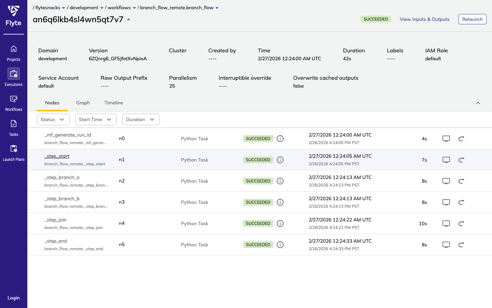
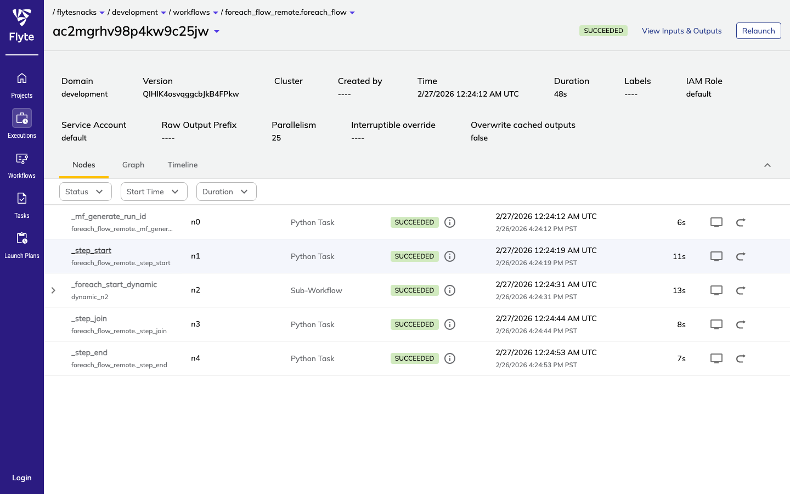
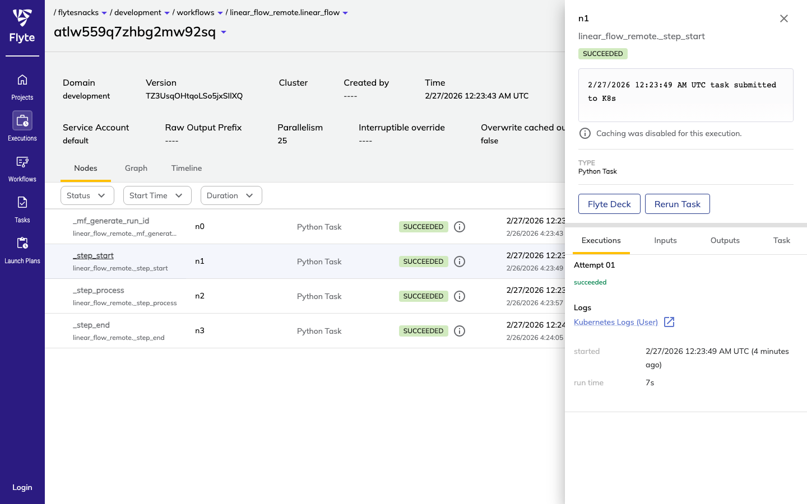
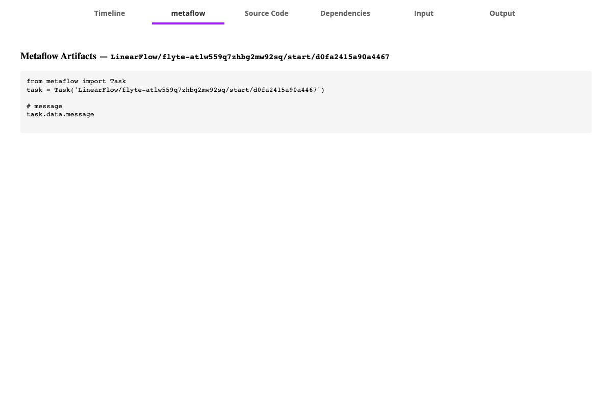
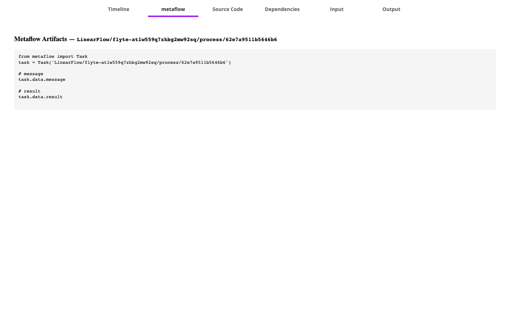
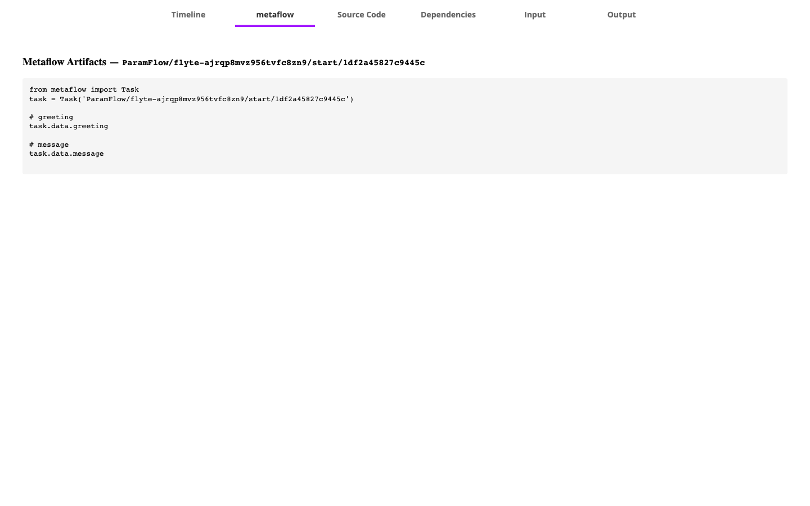

# metaflow-flyte

[](https://github.com/npow/metaflow-flyte/actions/workflows/ci.yml)
[](https://github.com/npow/metaflow-flyte/actions/workflows/e2e.yml)
[](https://pypi.org/project/metaflow-flyte/)
[](LICENSE)
[](https://www.python.org/downloads/) [](https://mintlify.com/npow/metaflow-flyte)

Schedule and monitor your Metaflow pipelines through Flyte without rewriting them.

## The problem

You've built pipelines in Metaflow and now need Flyte's scheduling, UI, and observability — but
rewriting your flows in Flytekit means losing Metaflow's versioning, artifact store, and local
execution model. Running both side-by-side means maintaining two copies of every pipeline.

## Quick start

```bash
pip install metaflow-flyte

# Generate the Flyte workflow file
python my_flow.py --datastore=s3 flyte create my_flow_remote.py \
    --image my-registry/my-image:latest

# Run locally (no cluster required)
pyflyte run my_flow_remote.py my_flow

# Register and run on a Flyte cluster
pyflyte register --project flytesnacks --domain development my_flow_remote.py
pyflyte run --remote --project flytesnacks --domain development \
    my_flow_remote.py my_flow
```

## Install

```bash
pip install metaflow-flyte
```

Or from source:

```bash
git clone https://github.com/npow/metaflow-flyte.git
cd metaflow-flyte
pip install -e ".[dev]"
```

## Usage

### Generate and register a Flyte workflow

```bash
python my_flow.py --datastore=s3 flyte create my_flow_remote.py \
    --image my-registry/my-image:latest

pyflyte register --project myproject --domain development my_flow_remote.py
```

### All graph shapes are supported

```python
# Linear
class SimpleFlow(FlowSpec):
    @step
    def start(self):
        self.value = 42
        self.next(self.end)
    @step
    def end(self): pass

# Split/join (branch)
class BranchFlow(FlowSpec):
    @step
    def start(self):
        self.next(self.branch_a, self.branch_b)
    ...

# Foreach fan-out
class ForeachFlow(FlowSpec):
    @step
    def start(self):
        self.items = [1, 2, 3]
        self.next(self.process, foreach="items")
    ...
```

### Parametrised flows

Parameters defined with `metaflow.Parameter` are forwarded automatically as Flyte workflow
arguments:

```bash
python param_flow.py --datastore=s3 flyte create param_flow_remote.py \
    --image my-registry/my-image:latest
```

Pass parameters at runtime:

```bash
pyflyte run --remote ... param_flow_remote.py param_flow --greeting "Hello"
```

### Step decorators (`--with`)

Inject Metaflow step decorators at deploy time without modifying the flow source:

```bash
python my_flow.py --datastore=s3 flyte create my_flow_remote.py \
    --image my-registry/my-image:latest \
    --with=kubernetes:cpu=4,memory=8000
```

### Retries

`@retry` on any step is picked up automatically. The generated Flyte task gets the corresponding
`retries` parameter:

```python
class MyFlow(FlowSpec):
    @retry(times=3)
    @step
    def train(self):
        ...
```

### Resource allocation

`@resources` on a step maps to native Flyte `Resources` — CPU, memory, and GPU are allocated
by the Flyte cluster rather than just hinted:

```python
class MyFlow(FlowSpec):
    @resources(cpu=4, memory=8000, gpu=1)
    @step
    def train(self):
        ...
```

Generates:

```python
@task(requests=Resources(cpu="4", mem="8000Mi", gpu="1"), ...)
def task_train(...): ...
```

### Scheduled flows

If your flow has a `@schedule` decorator, the generated file includes a Flyte `LaunchPlan` with
the corresponding cron schedule automatically.

### Event-driven LaunchPlans (`@trigger` / `@trigger_on_finish`)

Decorate your flow to emit Flyte `LaunchPlan` trigger configurations automatically.

```python
# Launch when a custom Flyte event label is matched
@trigger(event="data.ready")
class MyFlow(FlowSpec):
    ...
```

```python
# Launch when UpstreamFlow's LaunchPlan completes
@trigger_on_finish(flow="UpstreamFlow")
class DownstreamFlow(FlowSpec):
    ...
```

Both translate to `LaunchPlan` definitions with appropriate `triggers` in the generated file.

### Resume a failed run

Re-run a failed execution, skipping steps that already completed:

```bash
python my_flow.py flyte resume --run-id flyte-<execution-id>
```

The resumed run reuses completed step outputs via `--clone-run-id`, so only unfinished steps
re-execute.

### Project namespace

If the flow uses `@project(name=...)`, the Flyte project is automatically used:

```python
@project(name="recommendations")
class TrainFlow(FlowSpec): ...
```

## How it works

`metaflow-flyte` compiles your Metaflow flow's DAG into a self-contained Flyte workflow file.
Each Metaflow step becomes a `@task`. The generated file:

- runs each step as a subprocess via the standard `metaflow step` CLI
- derives a stable `run_id` from the Flyte execution ID so all steps share one Metaflow run
- passes `--input-paths` correctly for joins and foreach fan-outs
- emits Metaflow artifact retrieval snippets to the Flyte UI Deck after each step

### Executions list

All workflow executions are visible in the Flyte console with status, duration, and launch plan:



### Linear flow

A simple 3-step linear flow (`start → process → end`) runs as 4 Flyte tasks — one to generate
the shared run ID, then one per Metaflow step:



### Branch flow

Branch flows with split/join (`start → branch_a + branch_b → join → end`) run the parallel
steps concurrently as separate Flyte tasks:



### Foreach flow

Foreach fan-outs use a Flyte `@dynamic` task to spawn one task per item at runtime. The
`_foreach_*_dynamic` Sub-Workflow node fans out and collects results:



### Task detail and Flyte Deck

Click any task in the execution view to open the detail panel. Each Metaflow step produces a
**Flyte Deck** accessible via the "Flyte Deck" button:



### Metaflow artifact retrieval

The **metaflow** tab in the Flyte Deck shows the exact Python code to retrieve each artifact
from this specific task — using the full `FlowName/run_id/step_name/task_id` pathspec:



For tasks that produce multiple artifacts, each one is listed with its access expression:



Parametrised flows show the parameter values alongside the artifacts:



```python
# Retrieve artifacts from any completed Metaflow step
from metaflow import Task
task = Task('LinearFlow/flyte-atlw559q7zhbg2mw92sq/process/62e7a9511b5646b6')

task.data.message   # access the 'message' artifact
task.data.result    # access the 'result' artifact
```

## Configuration

The generated file bakes in datastore and image settings at creation time so every task
subprocess uses the same configuration.

```bash
# Use S3 datastore with a custom image
python my_flow.py \
  --datastore=s3 \
  flyte create my_flow_remote.py \
  --image my-registry/my-image:latest \
  --project flytesnacks \
  --domain development
```

### Docker image requirements

Your Docker image must contain:

1. The flow Python file at the same absolute path as on your local machine
2. All Python dependencies (`metaflow`, `flytekit`, `boto3`, etc.)
3. `USERNAME` environment variable set (e.g. `ENV USERNAME=metaflow`)
4. S3/datastore credentials and endpoint configuration

Example Dockerfile:

```dockerfile
FROM python:3.11-slim
RUN pip install "metaflow>=2.9" "flytekit>=1.10" "boto3>=1.26"
COPY my_flow.py /path/to/my_flow.py
ENV USERNAME=metaflow
```

## Development

```bash
git clone https://github.com/npow/metaflow-flyte.git
cd metaflow-flyte
pip install -e ".[dev]"

# Compilation tests only (fast, ~25s)
pytest tests/ -m "not integration and not e2e"

# Compilation + local pyflyte run (~3 min)
pytest tests/ -m "not e2e"

# E2e against a real Flyte cluster (see below)
pytest tests/test_e2e_remote.py -v --timeout=300
```

The test suite covers three tiers:
- **Tier 1**: compile all graph shapes → assert generated file content
- **Tier 2**: `pyflyte run` locally (in-process) → verify Metaflow artifacts written to disk
- **Tier 3**: `pyflyte run --remote` against a live cluster → real Flyte task pods, real S3 artifacts

**Running Tier 3 locally:**

```bash
# Start a local Flyte sandbox
flytectl demo start

# Build and tag the task container image
docker build -f Dockerfile.e2e -t localhost:30000/metaflow-flyte-e2e:dev .
docker push localhost:30000/metaflow-flyte-e2e:dev

# Copy flows to the stable container path and run
sudo mkdir -p /app/tests/flows && sudo cp tests/flows/*.py /app/tests/flows/

E2E_FLOWS_DIR=/app/tests/flows \
FLYTE_TEST_IMAGE=localhost:30000/metaflow-flyte-e2e:dev \
METAFLOW_DEFAULT_DATASTORE=s3 \
METAFLOW_DATASTORE_SYSROOT_S3=s3://my-s3-bucket/metaflow/ \
METAFLOW_S3_ENDPOINT_URL=http://localhost:30002 \
AWS_ACCESS_KEY_ID=minio AWS_SECRET_ACCESS_KEY=miniostorage AWS_DEFAULT_REGION=us-east-1 \
pytest tests/test_e2e_remote.py -v --timeout=300
```

Tier 3 also runs automatically on every push to `main` via the [E2E workflow](.github/workflows/e2e.yml).

## License

[Apache 2.0](LICENSE)
